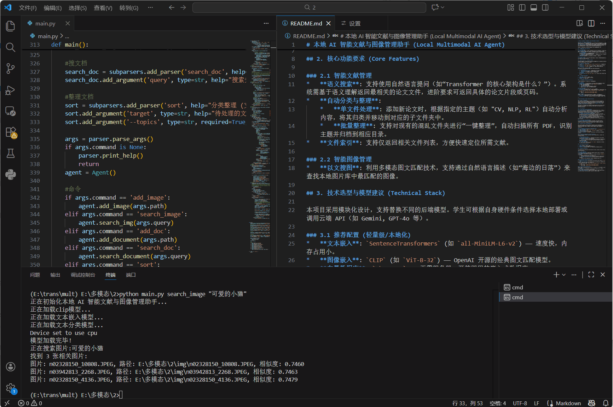
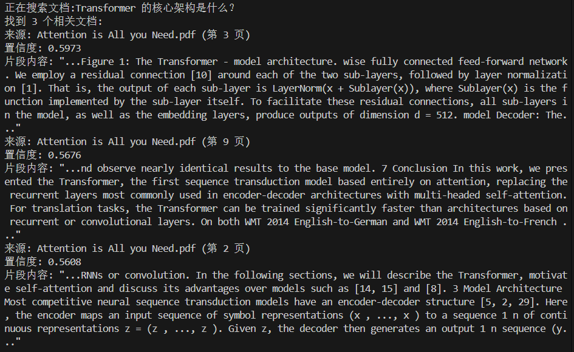
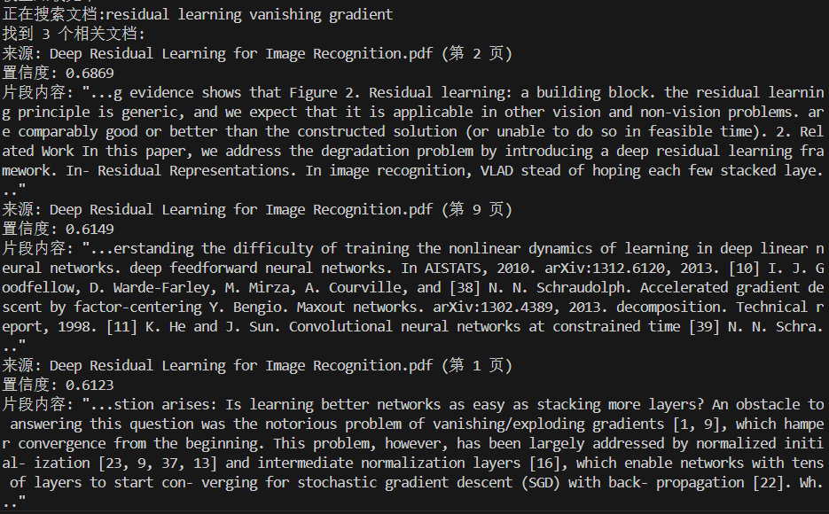
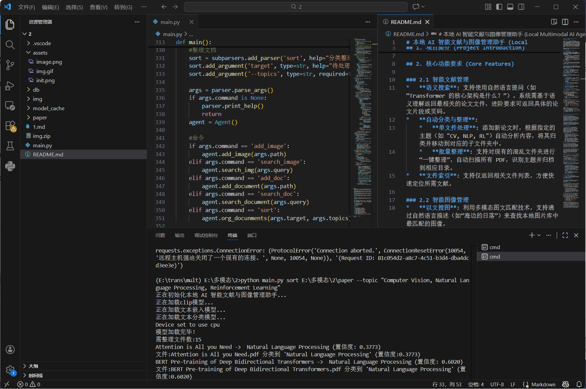

---

# Local AI Multimodal Manager (本地 AI 智能文献与图像管理助手)

本地化多模态资源管理工具。它利用多模态大模型（CLIP, Transformer），实现了对**图片**和**学术论文**的语义检索、深度内容分析以及自动化分类整理。所有数据和模型均存储在本地。

## 核心功能 (Core Features)

1.  **以文搜图 (Image Semantic Search)**
    *   支持使用自然语言（中文或英文）搜索本地图片库。
    *   无需标签，AI 自动理解图片内容（例如搜索 "一只在睡觉的猫" 即可找到对应图片）。
2.  **文档检索 (Deep Document Retrieval - RAG)**
    *   **片段级定位**：不仅仅是找到文档，还能精准定位到 PDF 的具体**页码**和**文本片段**。
    *   **跨语言检索**：支持用中文搜索英文论文。
    *   **抗干扰读取**：基于 `pdfplumber` 的智能文本提取，有效处理单词粘连和排版问题。
3.  **自动分类 (Zero-Shot Organization)**
    *   **零样本分类**：无需预先训练，只需提供类别名称（如 "CV, NLP, 金融"），AI 即可根据论文的**标题**和**摘要**自动将文件移动到对应文件夹。
    *   支持单个文件或整个文件夹的批量整理。
4.  **本地化**
    *   向量数据库 (`ChromaDB`) 和所有 AI 模型均存储在本地 (`./db` 和 `./model_cache`)。

---

## 技术选型 (Tech Stack)

本项目集成了多个模型与库，以实现最佳性能：

| 模块 | 技术/模型 | 说明 |
| :--- | :--- | :--- |
| **图像编码** | **OpenAI CLIP (ViT-B/32)** | 将图像转换为向量，实现图文对齐。 |
| **图像检索** | **Multilingual-CLIP** | `clip-ViT-B-32-multilingual-v1`，支持多语言文本搜图。 |
| **文档嵌入** | **Sentence-Transformer** | `paraphrase-multilingual-MiniLM-L12-v2`，强大的多语言文本向量化模型。 |
| **智能分类** | **BART-Large-MNLI** | `facebook/bart-large-mnli`，用于 Zero-Shot（零样本）文本分类。 |
| **数据库** | **ChromaDB** | 高性能本地向量数据库，支持余弦相似度检索。 |
| **PDF 处理** | **pdfplumber** | 专业的 PDF 文本提取库，解决复杂排版解析和乱码问题。 |

---

##  环境配置与安装 (Installation)

建议使用 Python 3.8+ 环境。

### 1. 克隆或下载代码
确保 `main.py` 在你的工作目录中。

### 2. 安装依赖库
请在终端运行以下命令安装所需依赖：

```bash
# 基础依赖
pip install torch torchvision
pip install chromadb transformers sentence-transformers pdfplumber pillow

pip install git+https://github.com/openai/CLIP.git
```

### 3. 目录结构说明
运行程序后，系统会自动创建以下文件夹：
*   `./model_cache`: 存放下载的模型文件（避免重复下载）。
*   `./db`: 存放 ChromaDB 向量数据库文件。

---

## 使用说明 (Usage)

所有操作均通过命令行 (`main.py`) 完成。

### 1. 图片管理

#### 添加图片到数据库
支持添加单张图片或整个文件夹（自动递归扫描）。
```bash
# 添加单张图片
python main.py add_image ./photos/cat.jpg

# 批量添加文件夹中的所有图片
python main.py add_image E:/images
```

#### 以文搜图
使用自然语言描述你想找的图片。
```bash
# 搜索示例
python main.py search_image "雪山下的湖泊"
python main.py search_image "a dog playing with a ball"
```

---

### 2. 文档（PDF）管理

#### 添加文档到数据库
系统会对 PDF 进行全文切片（Chunk），并记录页码。支持单文件或文件夹。
```bash
# 索引单个 PDF
python main.py add_doc ./papers/Attention_is_all_you_need.pdf

# 索引整个论文文件夹
python main.py add_doc E:/papers
```

#### 语义搜索文档
搜索文档的具体内容，返回相关片段、文件名及页码。
```bash
# 提问式搜索
python main.py search_doc "Transformer 的核心架构是什么？"

# 关键词搜索
python main.py search_doc "residual learning vanishing gradient"
```
> **输出示例：**
> ```text
> 来源: Attention is All you Need.pdf (第 3 页)
> 置信度: 0.5939
> 片段内容: "...Figure 1: The Transformer - model architecture..."
> ```

---

### 3. 智能文件整理 (Sort)

无需预先定义规则，只需告诉 AI 你想要的类别，它会自动分析文件内容并归类整理。

#### 核心逻辑
AI 会读取文件的**文件名**和**摘要**，结合你输入的类别进行推理。

#### 命令格式
```bash
python main.py sort <目标路径> --topics "<类别1>,<类别2>,<类别3>"
```

#### 示例
假设你有一堆论文在 `./downloads` 文件夹下，需要分成"CV,NLP,RL"三类：

```bash
# 自动将论文分类到 CV, NLP, RL 三个文件夹中
python main.py sort ./downloads --topics "Computer Vision, Natural Language Processing, Reinforcement Learning"
```

> **提示：** 为了提高分类准确率，建议使用**全称**（如 "Computer Vision" 而非 "CV"），或者在类别中加入相关关键词。
---
## 演示报告 (Demo Report)

本章展示了系统的核心功能运行效果。

### 1. 模型加载与初始化
系统首次运行时会自动加载 CLIP、Multilingual-CLIP、Sentence-Transformer 以及 BART-Large-MNLI 模型。


### 2. 核心功能演示

#### 2.1 以文搜图
**测试命令：** `python main.py search_image "可爱的小猫"`
**结果分析：** 系统成功理解了自然语言指令，并返回了语义最接近的图片，给出了相似度评分。


#### 2.2 文档检索
**测试命令：** `python main.py search_doc "Transformer 的核心架构是什么"`
**结果分析：** 
*   系统不仅找到了相关论文（*Attention is All You Need*）。
*   **精准定位**：准确返回了第 3 页和第 9 页。
*   **片段展示**：直接提取了包含 "Encoder-Decoder" 和 "Self-attention" 的关键文本片段。


#### 2.3 自动分类
**测试场景：** 对混合了 CV、NLP 和 RL 论文的文件夹进行整理。
**测试命令：** `python main.py sort E:\多模态\2\paper --topic "Computer Vision, Natural Language Processing, Reinforcement Learning"`
**结果分析：**
系统利用 Zero-Shot 分类模型，成功地将15篇论文都进行了分类


**整理后的文件夹结构：**


### 3. 实验结论
通过集成 CLIP 和 LLM 技术，本系统成功实现了本地化的多模态数据管理。相比传统基于文件名的搜索，语义检索在处理非结构化数据（图片、长文本）时表现出了极高的准确性和实用性。


---

## 注意事项 (Notes)

1.  **首次运行时间**：第一次运行时，程序会自动从 HuggingFace 和 OpenAI 下载所需的模型权重。请保持网络通畅，下载完成后模型会保存在 `./model_cache`，后续运行速度会非常快。
2.  **显存占用**：程序会自动检测 GPU。如果有 NVIDIA 显卡 (CUDA)，速度会显著提升；如果是 CPU 运行，处理大量 PDF 时可能会稍慢。
3.  **重置数据库**：如果需要清空数据重新索引，只需直接删除目录下的 `./db` 文件夹即可。

---
